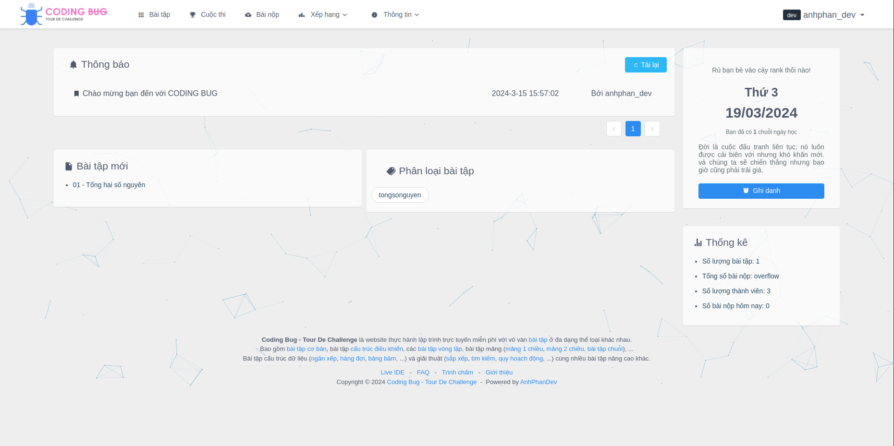

# Coding Bug - Tour De Challenge | FRONT END

## Xây dựng dựa trên QDOJ của tác giả Harry-zklcdc 

### Hướng dẫn triển khai máy chủ:

`Lưu ý:` Cần có Node.Js để triển khai:

```bash
# Kiểm tra phiên bản Node.Js
node -v
```

> Nếu đã có thì thực hiện tiếp tục BƯỚC 1, nếu chưa có thì thực hiện các bước cài đặt Node.Js bên dưới:
 
- Đối với Windows: Truy cập vào trang chủ [NodeJS](https://nodejs.org/en/download) để tải về và cài đặt
- Đối với Linux: 

    ```bash
    cd ~
    sudo apt update
    sudo apt install nodejs
    ```

#### 1. Clone repo:

```bash
git clone https://github.com/anhphoang-vncn/code-tour-de-challenge.git && cd code-tour-de-challenge
```

#### 2. Cài đặt thư viện:

```bash
npm install
```
```bash
NODE_ENV=development npm run build:dll
```
```bash
cp node_modules/echarts/lib/langEN.js node_modules/echarts/lib/lang.js
```

#### 3. Gán IP:PORT của máy chủ API chấm điểm [BACK-END](https://github.com/anhphoang-vncn/code-tour-de-challenge-back-end), khởi động môi trường dev với cổng 7676 (http://localhost:7676):

```bash
TARGET=http://127.0.0.1:80 npm run dev
```

### Ảnh chụp màn hình




### Dành cho Nhà phát triển

```bash
# Tùy chỉnh JavaScript/CSS
./src/styles

# Các trang
./src/pages

# Ngôn ngữ
./src/i18n
```

## Contact

    EMAIL: anhph.skyone@gmail.com

## LICENSE

[MIT](http://opensource.org/licenses/MIT)